# Producer cockpit walkthrough

Open `http://localhost:4004/producer/webapp/index.html` (demo login
producer/producer). The cockpit is wallet-only: every chain action, mint,
re-attest, grant/revoke anchors, burn and the ZK predicate mint, signs in the
connected CIP-30 browser wallet. No server signing key is needed to run it.

## 1. Passport list

The passport list is owner-gated: it renders only after a wallet is connected
and shows ONLY the passports owned by that wallet address. The header shows
the connected address; each row carries status and the attestation tx with an
explorer link.

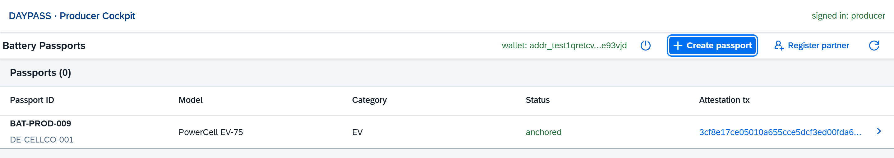

- **Connect wallet** starts the CIP-30 flow: enable, pick the funded address,
  then a signData sign-in. The wallet signs a one-time server challenge that
  contains the address, a random nonce and the issue timestamp:

  The server verifies the COSE_Sign1 via the plugin's `VerifyDataSignature`
  (the payload must equal the issued challenge, the signer's key hash must
  match the address) and mints an 8 hour session token. Every following API
  call is scoped SERVER-SIDE to this wallet's passports: foreign passports are
  invisible to reads and 403 on actions. New passports are created under the
  connected address.

- **Create passport** opens the Annex XIII form (prefilled example) with the
  sections General, Cell / battery, Due diligence and Recycled materials.
  Creation is always offline first (status `draft`); anchoring happens via
  Attest on the detail page. Decimals such as weight go on-chain as scaled
  integers later, Cardano metadata rejects floats.

  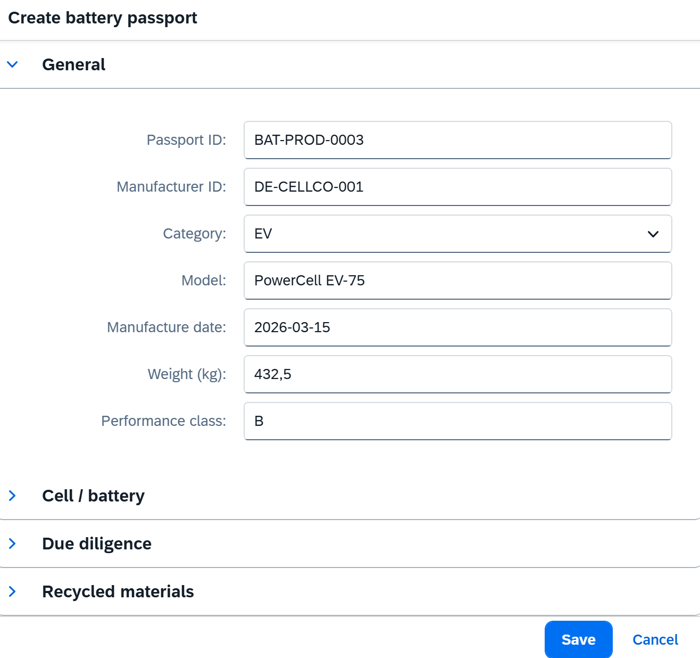

- **Register partner** adds a dataspace partner (DID/BPN, role, secret) and
  returns its pseudonymous granteeId, `sha256(did)`.

## 2. Passport detail

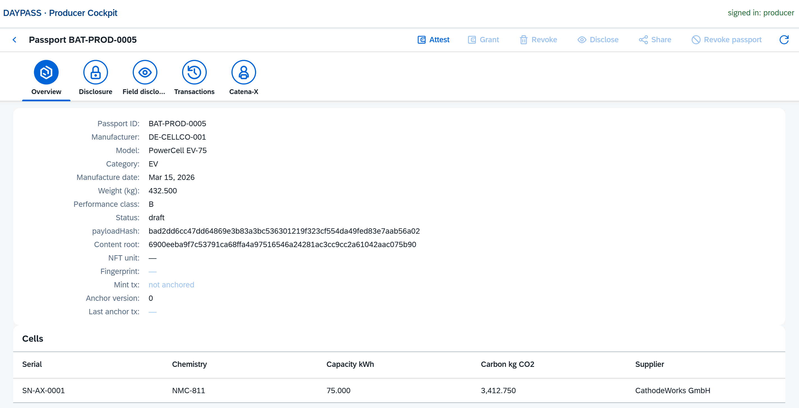

Header: **Attest**, **Grant**, **Revoke**, **Disclose**, **Share** and
**Revoke passport** (burn). All transaction buttons sign in the connected
CIP-30 wallet; Grant/Revoke/Disclose/Share unlock once the passport is
anchored. On a draft, payloadHash and content root are already computed from
the current rows, while NFT unit, fingerprint and mint tx stay empty and the
anchor version is 0.

- **Attest**: the server prepares the mint data with a Plutus V3 policy
  parameterized with the WALLET's payment key hash, so every producer wallet
  gets its own policy namespace. The browser builds the mint tx with the
  wallet as sender, then ONE signing popup:

  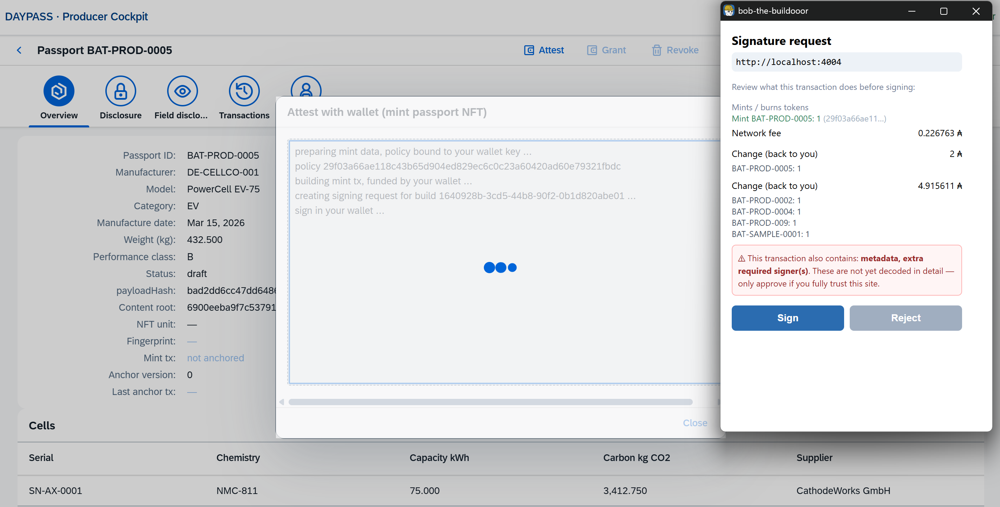

  The wallet decodes the mint (passport NFT under your policy), network fee
  and change. The "metadata, extra required signers" notice is expected: the
  anchor label (payloadHash, contentRoot, Point-1 fields) rides in the tx
  metadata, and the policy checks your key in the tx's extra signatories.
  After signing, the witness set goes straight to `SubmitVerifiedTransaction`;
  the server splices it into the untouched tx body, so the signed bytes stay
  identical. Watch the Transactions tab flip submitted -> confirmed. On an
  anchored passport the same button re-attests: it recomputes the payload from
  the current data and anchors the next version (or reports "no changes").

- **Overview** tab: Point-1 data plus the full Cardano lineage (payloadHash,
  content root, unit, fingerprint, mint and last anchor tx with explorer
  links).

- **Disclosure** tab: pick a partner + level, Grant/Revoke. Grants are server
  ACL rows with a wallet-signed pseudonymous on-chain audit anchor; the log
  shows grantee id, level, status and tx.

  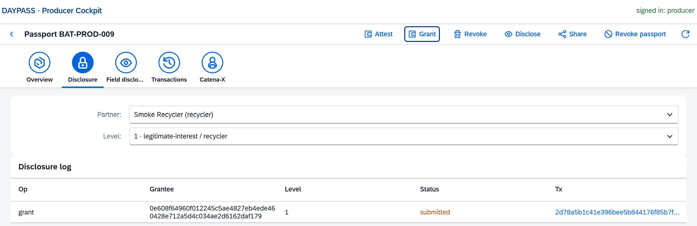

- **Field disclosure** tab: pick one of the nine provable fields and click
  Disclose. The result shows the value and its Merkle inclusion proof against
  the contentRoot anchored at attest time and can be downloaded as a
  disclosure JSON any Cardano API can verify; no transaction is needed. The
  **Zero-knowledge predicate** panel below shows the anchor's ZK status
  ("Poseidon root anchored, proofs available") and proves a threshold
  statement instead of revealing the value: pick predicate and threshold
  (provable fields are scaled x1000 on-chain, so 4000 kg CO2 / kWh anchors as
  4000000) and click Prove. The prover sidecar builds a Groth16 proof, the
  wallet mints a predicate token whose mint redeemer IS the proof, and the
  Plutus verifier runs the pairing check on-chain.

  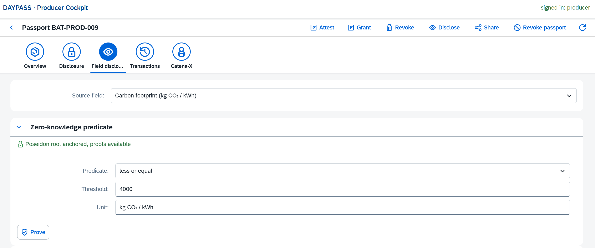

- **Transactions** tab: every on-chain step with status, tx hash and
  timestamp, linked to the explorer.

  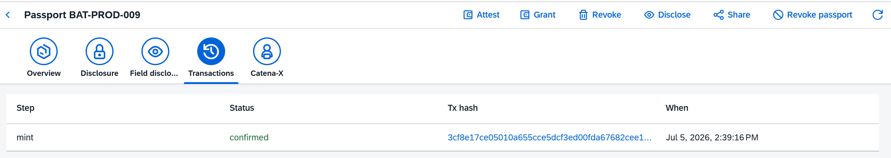

- **Catena-X** tab: Generate JSON exports the CX-0143 BatteryPass aspect;
  Build PAC assembles a W3C verifiable credential from the passport's
  disclosures and proofs. ZK predicates appear as `zkPredicate` entries with
  claim, threshold, proof system `groth16-bls12381` and the on-chain
  verification tx; verification model is `cardano-onchain`, portably
  re-checkable with `tractusx/pac/verify-pac.mjs` against any Blockfrost key.

  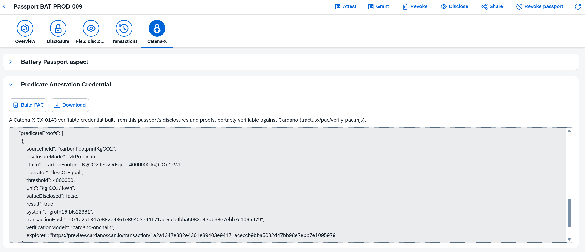

## 3. Consumer viewer

The QR on a battery (or `/p/<passportId>`) lands consumers on the public tier;
recyclers and authorities sign in for their views (tier redaction happens in
the API layer, all three tiers render from one backend).

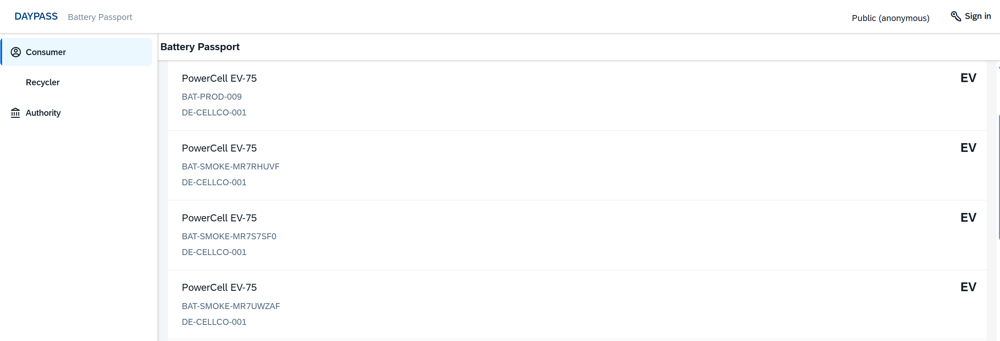

Each passport card shows the Point-1 fields plus the passport URL and a QR
code that deep-links to exactly this passport:

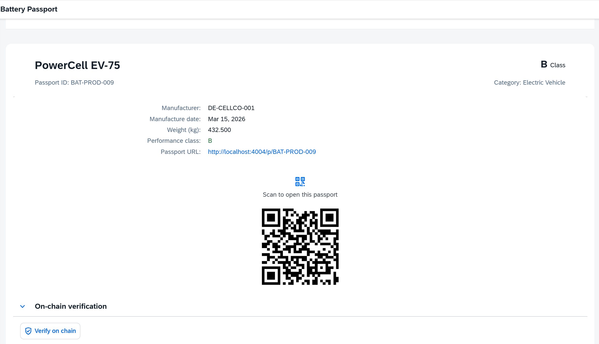

Every tier embeds an on-chain verification panel backed by the public
`/verify/<passportId>` endpoint. It re-runs the full evidence chain: the
cipher decrypts and re-hashes to the stored payloadHash, the DB rows re-derive
payloadHash and contentRoot, the anchor metadata is present on the last anchor
tx, the on-chain payloadHash, contentRoot and poseidonRoot match, and the NFT
exists with supply 1.

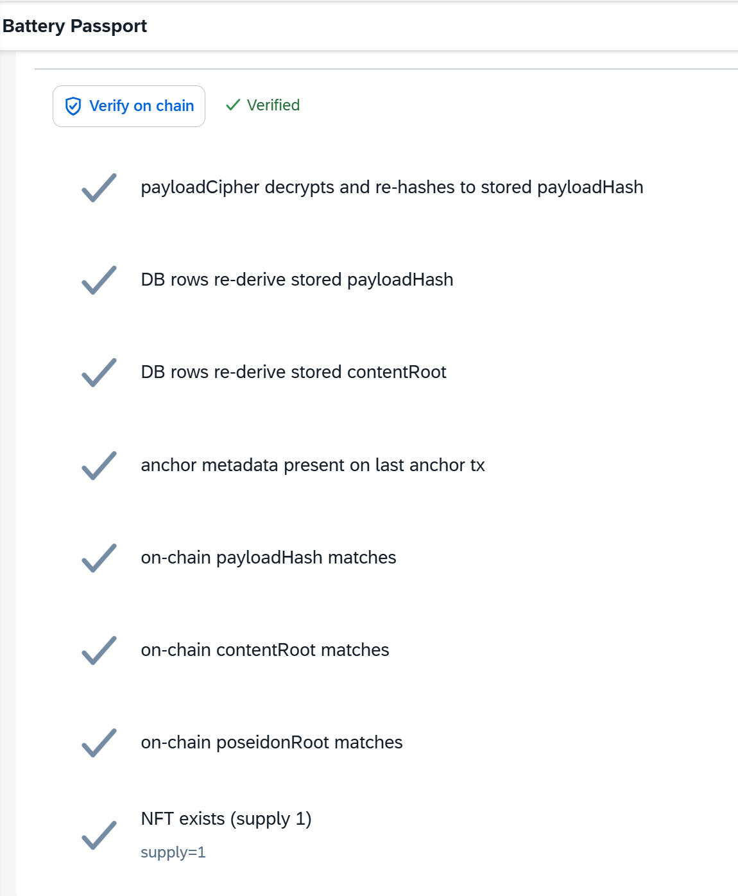
